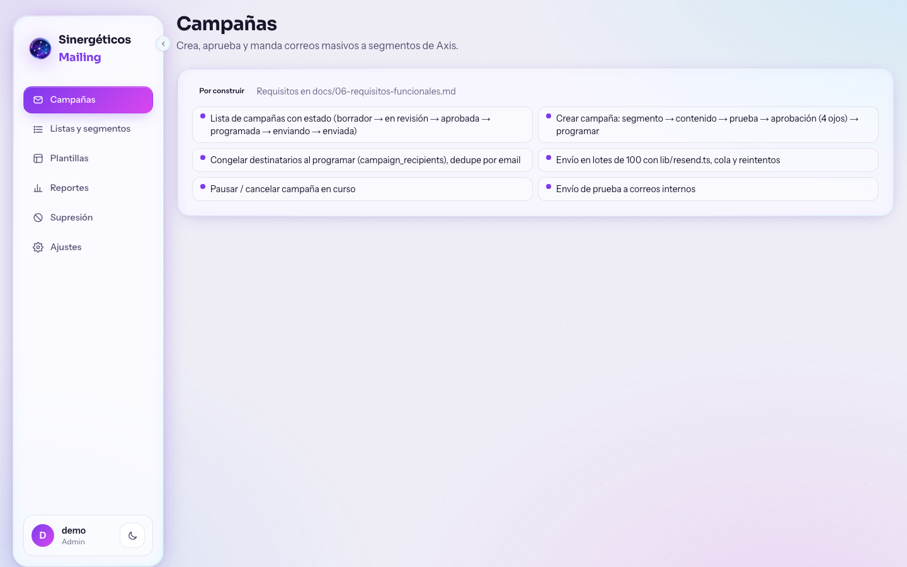
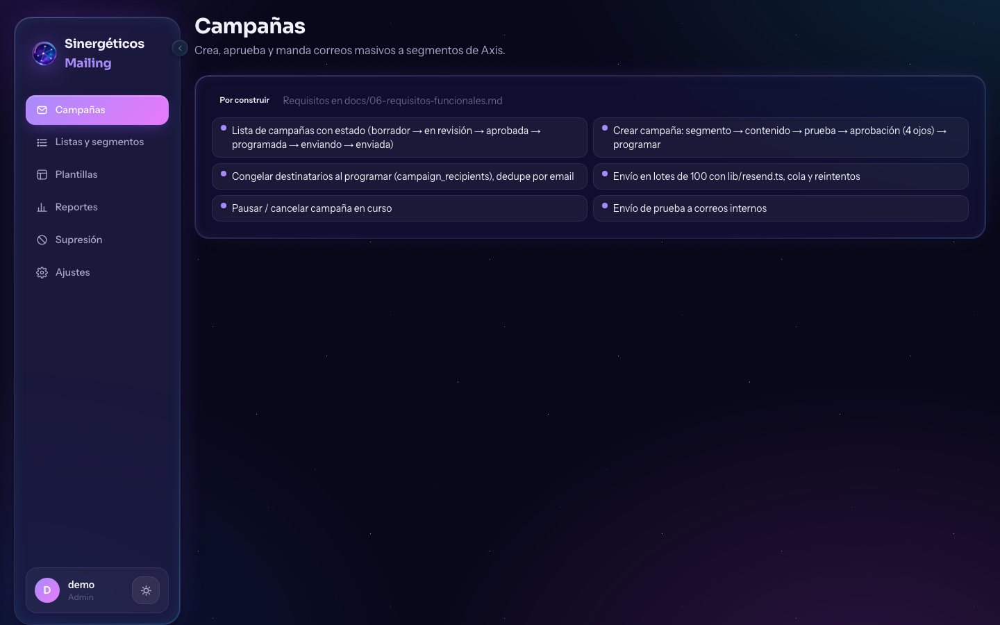

# mailing.sinergeticos.com — kit de arranque

Kit para construir la app de **mailing masivo de Sinergéticos** en `mailing.sinergeticos.com`.
Está pensado para que quien la construya tenga en un solo lugar el contexto, las decisiones
ya tomadas, la capa visual que debe copiar y el contrato de datos con **Axis** (el CRM central).

> Este repo es público **a propósito** para facilitar compartirlo. Por eso **no contiene ningún
> secreto**: ni API keys, ni cadenas de conexión, ni datos de contactos. Todo eso se entrega
> por un canal privado (ver `.env.example`).

## Las 5 decisiones que ya están tomadas

| # | Decisión | Detalle |
|---|----------|---------|
| 1 | **Los contactos viven en Axis** | Axis (`axis.sinergeticos.com`) es la fuente de verdad. La app de mailing **lee** `contacts`, `memberships`, `purchases`, `touchpoints` y `mail_supresion`; **no** los duplica ni los edita. → [docs/03-datos-desde-axis.md](docs/03-datos-desde-axis.md) |
| 2 | **Se manda por Resend** | La cuenta ya existe y el dominio `envios.sinergeticos.com` ya está verificado (desde el 3-ago-2026). Para masivo se recomienda un **subdominio de envío aparte** y subir de plan. → [docs/04-resend.md](docs/04-resend.md) |
| 3 | **Se copia el estilo visual de Axis** | Sistema "Liquid Glass Espacial": violeta + cyan + magenta, vidrio, aurora de fondo, modo claro/oscuro, fuentes Sora + Instrument Sans + Geist Mono. Los archivos están en [`estilo-axis/`](estilo-axis/). → [docs/05-estilo-visual-axis.md](docs/05-estilo-visual-axis.md) |
| 4 | **La app es independiente de Axis** | Repo propio, base propia para campañas/listas/eventos, deploy propio. Axis sigue siendo el único que manda correos **transaccionales**; la app de mailing manda los **masivos**. → [docs/02-lo-que-ya-existe-en-axis.md](docs/02-lo-que-ya-existe-en-axis.md) |
| 5 | **La supresión es compartida** | Toda baja, rebote duro o queja se respeta en ambos sistemas. Sin excepción. → [docs/06-requisitos-funcionales.md](docs/06-requisitos-funcionales.md) |

## Qué hay en el repo

```
starter/         App Next 16 EJECUTABLE con el shell de Axis ya conectado (build verde) ← empieza aquí
docs/            Contexto, hallazgos y requisitos (léelos en orden, son cortos) + capturas/ + BITACORA.md
estilo-axis/     CSS de tokens, layout raíz con fuentes, sidebar, nav, íconos, toggle de tema, logo (originales de Axis)
esquema/         DDL de las tablas de Axis que se leen + esquema propuesto para la app
ejemplos/        Scripts mínimos: enviar prueba, enviar lote, verificar webhook, plantilla HTML
.env.example     Variables que la app necesita (los valores se entregan en privado)
```

## Así se ve el starter (mismo look que Axis)

| Claro | Oscuro |
|-------|--------|
|  |  |

## Cómo arrancar (30 minutos)

1. Lee `docs/01` → `docs/07` (≈15 min).
2. Pide en privado: `RESEND_API_KEY` (una key nueva solo para esta app), el acceso de **solo lectura**
   a la base de Axis y el `RESEND_WEBHOOK_SECRET` cuando registres tu webhook.
3. `cd starter && cp .env.example .env.local && npm install && npm run dev` → ya tienes el look de Axis,
   la navegación, el envío por lotes, la lectura de segmentos desde Axis, la liga de baja y el webhook
   (ver `starter/README.md` para qué está listo y qué es stub).
   Si prefieres otro stack, toma solo `estilo-axis/` y los `ejemplos/`.
4. Corre `node ejemplos/enviar-prueba.mjs tu@correo.com` con tu key para confirmar que Resend responde.
5. Construye a tu medida siguiendo `docs/06-requisitos-funcionales.md`.

## Stack de referencia (el que usa Axis)

Next.js 16 · React 19 · Tailwind CSS v4 (sin `tailwind.config`, todo en `globals.css`) · Supabase
(`@supabase/ssr`) · Vercel · Resend. **Sin** librería de componentes: los botones, chips, tablas e
inputs son clases utilitarias propias (`.glass`, `.btn-accent`, `.chip`, `.table-glass`, `.input-glass`).

## Contacto

Dueño del proyecto: Manuel de León (Sinergéticos). Los accesos se piden a él, nunca se suben aquí.

---
© Sinergéticos. Publicado para colaboración; todos los derechos reservados.
